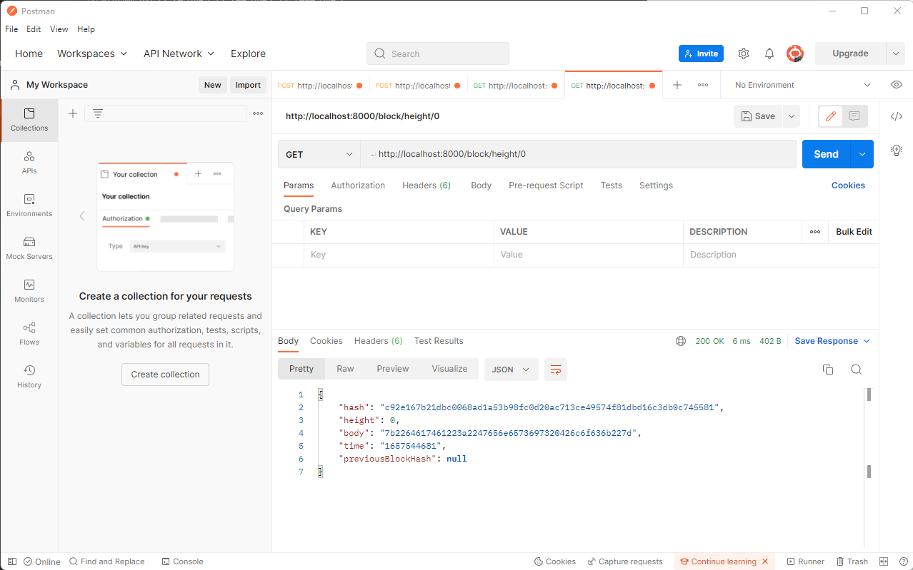
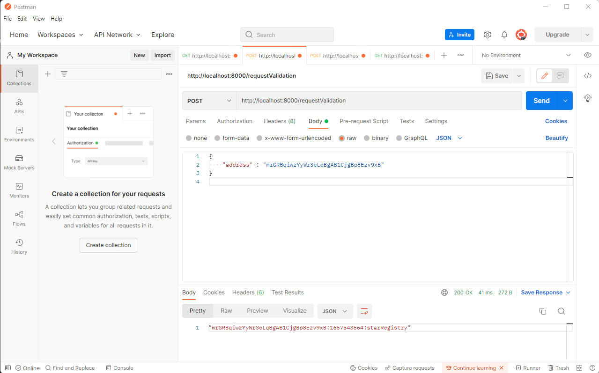
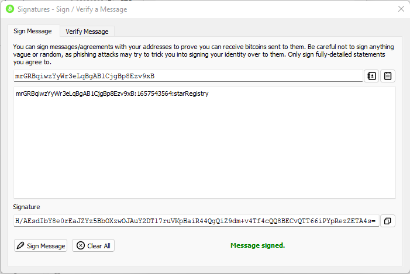
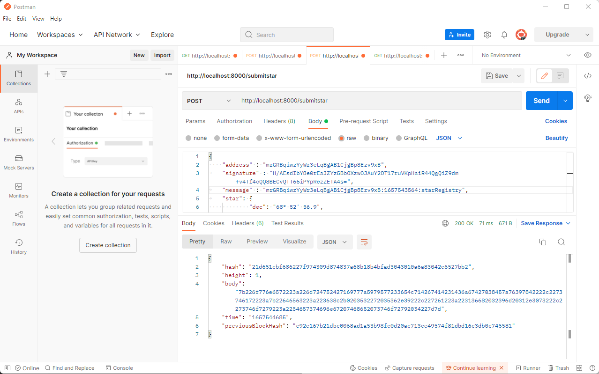
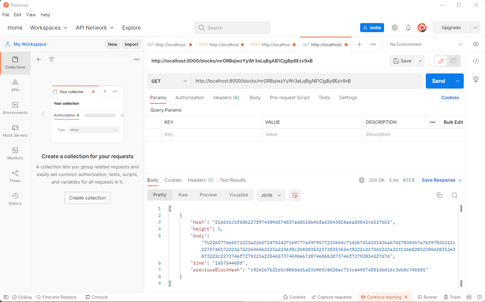

# 1. Private Blockchain - astronomy star ownership
In this repository you will find the code for the private blockchain proof of concept on how a blockchain application can be implemented.

The idea is that poeple interested in astronomy will be able to register stars in the univers and track their ownership.


## Steps required to implement this application
1.	The application will create a Genesis Block when we run the application.
2.	The user will request the application to send a message to be signed using a Wallet and in this way verify the ownership over the wallet address. The message format will be:

```<WALLET_ADRESS>:${new Date().getTime().toString().slice(0,-3)}:starRegistry;```

3.	Once the user has the message they can use a Wallet (Electrum or Bitcoin Core for example) to sign the message.
4.	The user will try to submit the Star object for that. The submission will consist of: wallet address, message, signature and the star object with the star information. The Start information will be formed in this format:
```json
"star": {
    "dec": "68° 52' 56.9",
    "ra": "16h 29m 1.0s",
    "story": "Testing the story 4"
}
```

5.	The application will verify if the time elapsed from the request ownership (the time is contained in the message) and the time when you submit the star is less than 5 minutes.
6.	If everything is okay the star information will be stored in the block and added to the chain encoding the Star information.
7.	The application will allow us to retrieve the Star objects belong to an owner (wallet address). This information should be human readable so it shouldn't be encoded.

## Tools or technologies used in the application
This application will be created using Node.js and Javascript programming language. The architecture will use ES6 classes because it will help us to organize the code and facilitate the maintenance of the code.
We suggest you use Visual Studio Code as an IDE because it will help easily debug your code, but you can choose any code editor you feel comfortable with.
Some of the libraries or npm modules you will use are:

* "bitcoinjs-lib": "^4.0.3",
* "bitcoinjs-message": "^2.0.0",
* "body-parser": "^1.18.3",
* "crypto-js": "^3.1.9-1",
* "express": "^4.16.4",
* "hex2ascii": "0.0.3",
* "morgan": "^1.9.1"


## Application Code
All the code related to the implementation of this private project can be found in this reposatory.  

## Application Testing
In this section a number of tests using Postman have been carried out to demonstrate that the application works correctly

##### Application is working fine and it creates the Genesis Block



##### Request of ownership using a wallet address



##### Signing the message with the same Wallet:



##### Submitting a Star



##### Retrieve Stars owned by me




